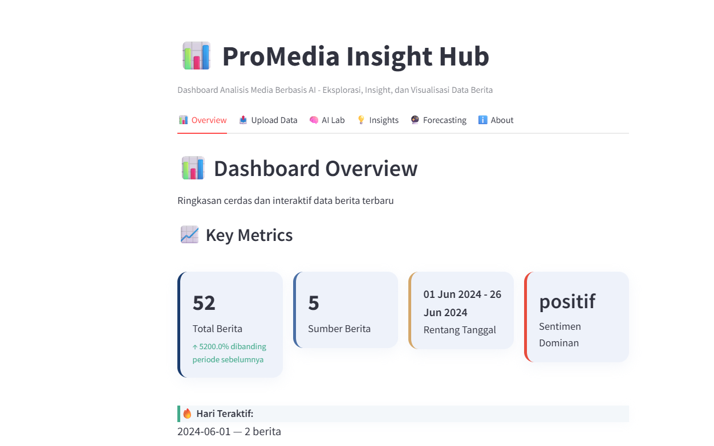
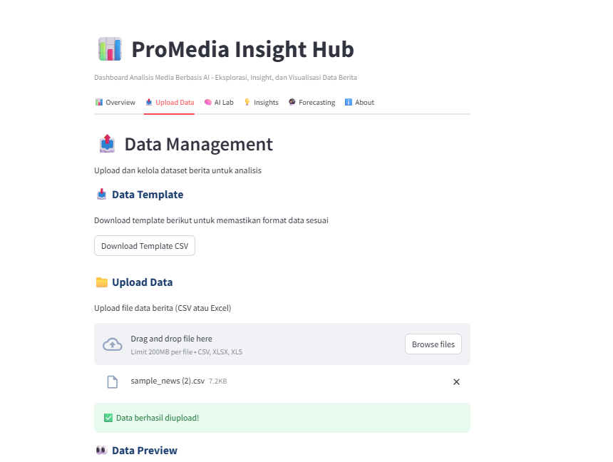

# 

[](https://pro-media-dashboard.streamlit.app/)
<br>
🌐 **[LIVE DEMO: Access ProMedia Insight Hub](https://pro-media-dashboard.streamlit.app/)**

> **Note:**  
> Currently, the dashboard interface and all features are **available in Indonesian only**.  
> For bilingual (English/Indonesian) support, feel free to fork or contribute!

---

## 🚀 Live Demo

Try the dashboard instantly:  
[https://pro-media-dashboard.streamlit.app/](https://pro-media-dashboard.streamlit.app/)

- **Default admin login:**  
  - Username: `admin`  
  - Password: `admin123`

---

**ProMedia Insight Hub** is an AI-powered media analytics dashboard designed to help you manage, analyze, and extract strategic insights from news data in a modern, interactive, and efficient way.

---

## ✨ Main Features

- **Multi-user & Admin Login:**  
  Secure authentication with user and admin roles. Admins can add new users from the dashboard, and each user accesses features according to their permissions.

- **Data Upload & Management:**  
  Upload news datasets (Excel/CSV) using the provided template. Easily manage and process your data.

- **Dashboard Overview:**  
  Interactive visualizations: total news count, distribution, daily trends, top sources/topics, and public sentiment insights.

- **Automatic Sentiment Analysis:**  
  Detects and analyzes news sentiment automatically to understand public opinion on key issues.

- **Forecasting & Trend Prediction:**  
  Projects news volume/sentiment trends using robust statistical methods (Moving Average & Linear Regression). Automated strategic insights are available via Gemini AI.

- **AI Data Lab:**  
  Built-in AI Q&A (Gemini) for instant insight, anomaly detection, or data-driven strategic recommendations.

- **Strategic Insights & Recommendations:**  
  Save key findings, AI recommendations, and export analyses for further use.

- **Top Topics & Sources:**  
  Identify the most influential topics and news sources in real time.

- **Modern Responsive Interface:**  
  Clean, professional dashboard—comfortable on desktop or tablet.

---

## 🎯 Purpose & Benefits

- Empower media analysts to **process and understand news data faster and more efficiently**.
- **Automate insight extraction** using AI, so you can generate strategies, spot trends, and understand public sentiment—no manual coding required.
- Provide a **modular and extendable dashboard solution** for portfolios, internships, research, or organizational needs.

---

## 🔑 Demo Login Access

- **Default admin account:**  
  - Username: `admin`  
  - Password: `admin123`
- After logging in as admin, you can create new user accounts via the *Add User* feature (admin menu).
- User management (register, delete, assign role) is admin-only.

---

## 🔐 Authentication System

- **Secure login:**  
  Each user must log in with username & password.
- **Role management:**  
  - **Admin:** can add/remove users, manage roles, access admin features.
  - **User:** can access dashboard features as permitted.
- **Authentication powered by [streamlit-authenticator](https://github.com/mkhorasani/Streamlit-Authenticator)**  
  User data is securely stored in the database/config.
- **Auto-logout** on inactivity for session safety.

---

## 🛠️ Technology Stack

- **Language & Framework:**  
  Python, Streamlit, HTML & CSS (embedded in Python code via Streamlit)

- **Data Science & Analytics:**  
  pandas, numpy, plotly, matplotlib, openpyxl, networkx, scikit-learn, statsmodels, tabulate, fpdf2

- **AI/ML:**  
  google-generativeai (Gemini), textblob

- **Database & Auth:**  
  SQLite, sqlite3, SQLAlchemy, streamlit-authenticator, hashlib

- **Environment & Deployment:**  
  Docker, docker-compose, python-dotenv, Devcontainer (VS Code)

- **Frontend Customization:**  
  *HTML and CSS are used inline through* `st.markdown(..., unsafe_allow_html=True)` *for custom dashboard styling.*

---
## 🖥️ Deployment

This project is deployed on a **VPS (Virtual Private Server) running Linux Ubuntu** using **Docker** for containerization and process management.  
All services (Streamlit app, database, and supporting libraries) are orchestrated via Docker Compose, ensuring robust, isolated, and reproducible deployments.  
You can easily adapt the setup for your own VPS or cloud server that supports Docker.

---
## 📁 Project Structure

```
.
├── app.py                  # Main application, routing, global state
├── auth.py                 # Authentication logic & user management
├── database.py             # Database utilities (SQLite)
├── gemini_engine.py        # Google Gemini AI integration
├── components/             # Modular components/tabs
│   ├── tab_overview.py
│   ├── tab_upload.py
│   ├── tab_ai_lab.py
│   ├── tab_insights.py
│   ├── tab_forecasting.py
│   ├── tab_about.py
├── requirements.txt        # Python dependencies
├── Dockerfile              # Container build (Python + Streamlit)
├── .devcontainer/          # VS Code Devcontainer setup (optional)
├── data/                   
│   ├── sample_news.csv
└── .gitignore              # Files/folders to ignore in git
```

---

## ⚡️ Getting Started Locally

1. **Clone the repository**
    ```bash
    git clone https://github.com/r1afif18/pro-media-dashboard.git
    cd pro-media-dashboard
    ```

2. **Install dependencies**
    ```bash
    pip install -r requirements.txt
    ```

3. **(Optional) Set up the `.env` file**  
    Add your API keys, database path, etc. as needed.

4. **Run the application**
    ```bash
    streamlit run app.py
    ```

5. **Log in using the provided admin/user credentials, upload a dataset, and explore the dashboard features.**

---

## 🖼️ Dashboard Screenshots

> 
>
> 
> 

---

## 💡 Development & Contribution Tips

- The app is modular and easy to extend with new features, additional languages, or more analytics/AI integrations.
- Suitable for portfolios, research, internships, organizations, or custom client projects.
- Feel free to fork, submit pull requests, or open issues for suggestions or bugs.

---

## 👤 Developer

[](https://www.linkedin.com/in/rafif-sudanta/)
[](mailto:rafifsudanta1@gmail.com)
[](https://github.com/r1afif18/pro-media-dashboard)

Developed by **Rafif Sudanta**

> For collaboration, joint projects, or dashboard & AI consulting, feel free to connect via [LinkedIn](https://www.linkedin.com/in/rafif-sudanta/) or [email](mailto:rafifsudanta1@gmail.com).
---

## 📝 License

MIT License — Free to use & develop for education, portfolios, research, or organizational needs.

---
